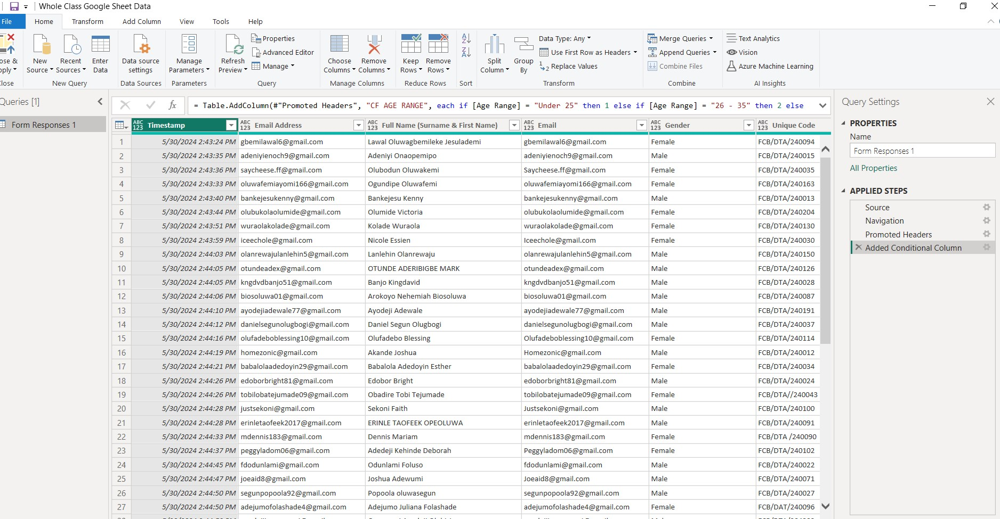
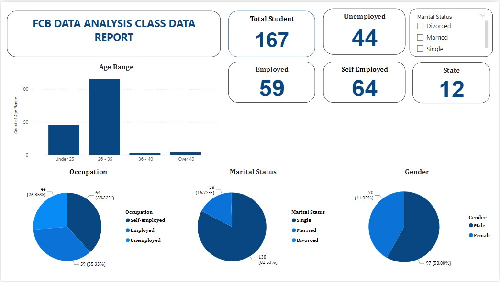
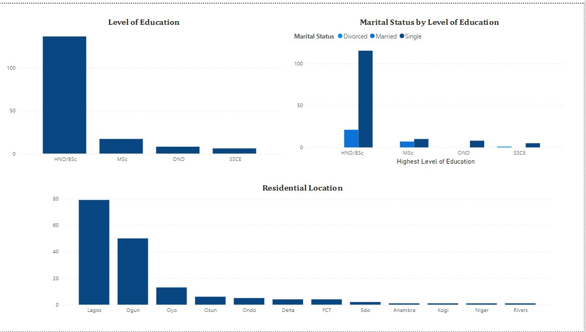

# FCB-Data-Analysis-Class-Data
The current Data Analysis class faces several challenges that limit its inclusivity and effectiveness.
Despite having a diverse group of 167 participants from 12 states in Nigeria, there is a significant underrepresentation of youth from the South East, North Central regions and other regions. The Incubator Nigeria (Organizers) also needs to address the needs of SSCE holders and support self-employed and unemployed participants more effectively. 
Addressing these issues is crucial to ensuring that subsequent boot camps meets the diverse needs of all its participants and maximizes its impact.

## Table of Content

Introduction

Data Source

Tool Used

Data Transformation and Loading

Data Analysis and Visualization

Insights and Implications

Recommendation

Conclusion

- - -

## Introduction
This project aims to enhance the inclusivity, accessibility, and overall effectiveness of the Data Analysis class in the Future Clan Boot-camp by Incubator Nigeria and Rccg Continent 3. This will be achieved by increasing regional diversity, supporting various educational background, and employment status and providing flexible learning options to accommodate participants' different needs and circumstances.

## Data Sources 
The primary data sources for this project is the class data of all Data analysis participants in the Future Clan Bootcamp by Incubator Nigeria and RCCG Continent 3

https://docs.google.com/spreadsheets/d/1slHSvA-UtOkseFsfuJJZiOL222vusWt6xEbFOXYxElQ/edit#gid=1248562073

## Tools Used
- **Microsoft Power BI** [Donwload here](https://www.microsoft.com/en-us/download/details.aspx?id=58494)
- **Google Sheets** 

## Data Transformation and Cleaning
Using the Power Query Editor, the data was meticulously cleaned to ensure it was neat and ready for analysis. I addressed inconsistencies in data types and checked the column quality and distribution to ensure accuracy and completeness.

## Data Analysis and Visualization

The analysis of the Data Analysis class involved a comprehensive examination of participant demographics, employment status, and educational background. Using various analytical tools, we categorized 167 participants into self-employed, employed, and unemployed groups. These participants were then mapped according to their states of origin, revealing a high concentration from Lagos, Ogun, and Oyo in the South West, with fewer participants from the South East and North Central regions. Age distribution was also analyzed, showing that most participants are between 26 and 35 years old.

Visualizations were created to depict the data distribution across multiple dimensions. Bar charts and pie charts were used to illustrate employment status, showing that self-employed participants are the largest group. Geographic maps highlighted the regional diversity, with clear indications of participant concentrations. Age distribution was represented through histograms, reinforcing the prevalence of young adults in the program.

Education levels were visualized through stacked bar charts, demonstrating that most participants hold HND/BSc degrees, with fewer holding MSc, OND, and SSCE qualifications. Additionally, gender distribution was shown using a balanced pie chart, highlighting the slight female majority.

These visualizations provided clear insights into the demographic composition, educational background, and regional distribution of participants, guiding the recommendations to enhance the program's inclusivity and effectiveness.

## Insights

-The Data Analysis class comprises 167 participants, categorized as 69 self-employed, 59 employed, and 44 unemployed individuals. 
These participants hail from 12 states in Nigeria, with the highest representation from Lagos, Ogun, and Oyo in the South West, likely due to geographical proximity. There are fewer participants from the South East and North Central regions.

-The age distribution of the majority falls between 26 and 35 years. The predominant employment status is self-employed, suggesting a significant number of business owners, followed by employed participants, with the unemployed being the least represented group. Most participants are single, aligning with the prevalent age range. The gender distribution is relatively balanced, with a slight female majority.

-In terms of education, most participants hold HND/BSc degrees, followed by a smaller number with MSc, OND, and SSCE qualifications. The chart illustrates the distribution across education levels, marital status, and residential locations, highlighting that the majority have HND/BSc degrees, are married, and reside in Lagos.

## Recommendation

-Increase awareness efforts so that Youth from other region will also be a beneficiary of the subsequent edition. Enhance regional diversity and participation.

-Utilize social media awareness and targeted Ads and virtual class options to attract participants from more remote areas.

-Pay attention to SSCE holders and encourage them to participate in subsequent boot camps 

-Provide comprehensive online resources and recorded sessions for participants who may not be able to attend all classes in person.

-Offer flexible class schedules to accommodate employed participants who may have time constraints.

-It is recommended to develop more programs and resources to support self-employed and unemployed offering more career services and internship and job opportunities help them find jobs.

-Implementing these recommendations will enhance the inclusivity, accessibility, and overall effectiveness of the Data Analysis class, ensuring it meets the diverse needs of all participants.

## Conclusion

The Data Analysis class has a diverse group of 167 participants with varied employment statuses, educational backgrounds, and geographic origins.
The majority are self-employed, indicating a strong presence of entrepreneurs, and most participants are between the ages of 26 and 35. The slight female majority and the predominance of single individuals suggest a young and relatively balanced gender demographic. The highest concentration of participants comes from Lagos, Ogun, and Oyo states, reflecting the influence of geographical proximity on attendance. Most participants hold HND/BSc degrees, underscoring a well-educated cohort.
